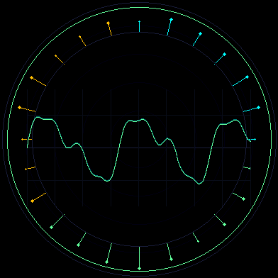

<p align="center">
  
</p>

# Ambient Scope

A circular oscilloscope and ambient-noise instrument for the
**Waveshare ESP32-S3-Touch-AMOLED-1.75-B/C**.

Ambient Scope fills the round AMOLED with a luminous auto-gain waveform,
short-lived persistence trails, and a radial low/mid/high spectrum. It runs
entirely on the device at approximately 30 FPS.

The animation uses the current firmware renderer with a synthetic test signal;
no recorded audio is stored in this repository. The physical device renders
the same layout from its live microphones.

## Controls

- **Tap** to freeze or release the trace.
- **Swipe up** to cycle combined, waveform, and spectrum views.
- **Swipe down** to cycle range and persistence.

The outer ring communicates state without small text:

- dim cyan — quiet
- mint — live sound
- red — clipping
- amber — hold
- crossed red rings — microphone error

## Hardware

- Waveshare ESP32-S3-Touch-AMOLED-1.75-B/C
- 466x466 CO5300 round AMOLED
- CST9217 touch controller
- ES7210 microphone ADC
- 8 MB OPI PSRAM / 16 MB flash

The two onboard microphones are MIC1 and MIC2 on the ES7210 at I2C address
`0x40`. Capture uses GPIO42 MCLK, GPIO9 BCLK, GPIO45 LRCK, and GPIO10 SDOUT1 at
16 kHz / 16-bit stereo standard I2S. The separate ES8311 playback path and
GPIO46 speaker amplifier remain disabled to prevent feedback.

## Privacy

Raw samples exist only in fixed-size RAM buffers. Ambient Scope does not save,
transmit, reconstruct, or write audio to microSD. Wi-Fi is not started. USB
diagnostics contain only bounded aggregate levels, frequency bands, and frame
timing. Dead or unavailable capture produces the microphone-error display
instead of a synthetic waveform.

## Build

Requirements:

- Arduino CLI 1.5.1
- Espressif Arduino core `esp32:esp32@3.3.10`
- `git` and `clang++`

Install the pinned ESP32 core once:

```bash
arduino-cli config init
arduino-cli config add board_manager.additional_urls \
  https://raw.githubusercontent.com/espressif/arduino-esp32/gh-pages/package_esp32_index.json
arduino-cli core update-index
arduino-cli core install esp32:esp32@3.3.10
```

Build the native tests and firmware:

```bash
bash tools/test.sh
bash tools/arduino.sh build
```

`tools/arduino.sh` fetches only the required libraries from the pinned
Waveshare revision into `.deps/`. Firmware artifacts are written to
`build/firmware/`.

## Flash

Flashing replaces the application and partition table on the selected device.
It does not erase or access the microSD card.

```bash
bash tools/arduino.sh upload /dev/cu.usbmodem1101
```

Use the Espressif USB serial/JTAG port reported by your operating system.
Whole-chip erase is not required.

## Architecture

- `AmbientScope.ino` — display transfer, touch controls, frame pacing, and
  aggregate diagnostics.
- `AmbientScopeAudio.*` — single I2S capture owner and two-slot snapshot handoff.
- `Es7210Capture.*` — minimal record-only ES7210 initialization.
- `AudioAnalyzer.*` — DC removal, adaptive noise floor, bounded AGC, clipping,
  waveform extraction, and fixed-size spectral analysis.
- `AmbientScopeRenderer.*` — hardware-independent RGB565 circular renderer.
- `tests/test_ambient_scope.cpp` — native signal, frequency, AGC, clipping,
  framebuffer-bounds, error-state, and control tests.

Capture and analysis run off the display loop with fixed-size storage and no
per-frame allocation. The foreground renders only complete snapshots.

## Verified device results

- 30.3 FPS with 33–35 ms worst presentation gaps
- quiet-room RMS around `0.00029–0.00037`
- speech transitions correctly from quiet to live
- controlled 1 kHz tone identified at 1000 Hz with mid-band energy `0.94–1.00`
- sustained run without watchdog resets, capture starvation, or memory loss

## Regenerate the preview

```bash
clang++ -std=c++17 -O2 -Wall -Wextra -Werror \
  tools/ambient_scope_preview.cpp \
  firmware/AmbientScope/src/AmbientScopeRenderer.cpp \
  -o build/ambient-scope-preview

build/ambient-scope-preview | ffmpeg \
  -f rawvideo -pixel_format rgb24 -video_size 392x392 -framerate 20 -i - \
  -vf "fps=20,split[s0][s1];[s0]palettegen=max_colors=128[p];[s1][p]paletteuse" \
  -loop 0 -y preview/ambient-scope.gif
```

The display, touch, and board bring-up were derived from the Waveshare examples
and the ESP32 Agent Companion platform.

## License

MIT
